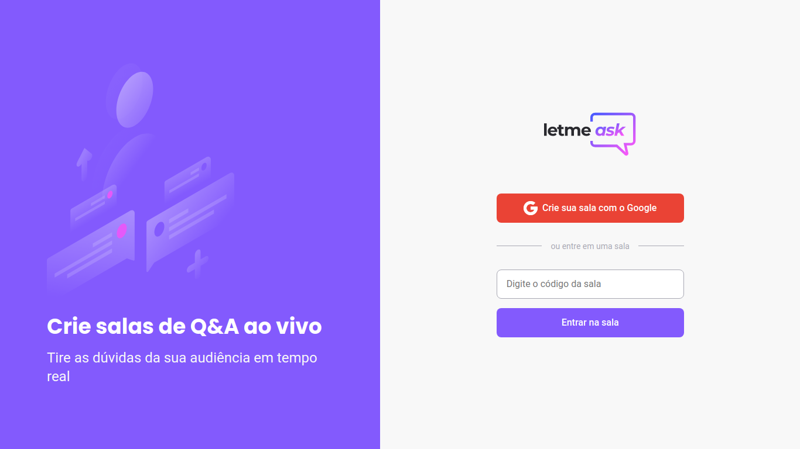

<h1>
Letmeask
</h1>

## 💻 Como acessar o projeto

### Clique [aqui](https://letmeask-78eb7.web.app/) para acessar a aplicação.

<h1></h1>

<h1>
  
</h1>

<h3>Mais imagens do projeto:</h3>

- [User Page](./images/user-page.png)
- [Admin Page](./images/admin-page.png)
- [Delete Page](./images/delete-question.png)

## 📃 Sobre

O projeto **Letmeask** é uma aplicação desenvolvida durante a NLW-Together da Rocketseat. Ela tem como objetivo filtrar as principais perguntas realizadas pelos alunos durante uma live. Com isso o professor poderá ver quais foram as perguntas com mais **likes** e com isso ir respondendo uma a uma com calma, diferentemente do que acontece no YouTube por exemplo, onde é difícil acompanhar as mensagens pelo chat.

## 🚀 Tecnologias utilizadas

O projeto foi desenvolvido utilizando as seguintes tecnologias:

- [ReactJS](https://reactjs.org/)
- [SCSS](https://sass-lang.com/)
- [Typescript](https://www.typescriptlang.org/)
- [React Modal](https://github.com/reactjs/react-modal) : Componente de diálogo modal para ReactJS.
- [React Hot Toast](https://react-hot-toast.com/) Biblioteca de notificações.

</p>

## 📥 Como baixar a aplicação

```bash
    $ git clone https://github.com/eliezer537/NLW-Together.git
```

## 🖱️ Para iniciar a aplicação

```bash
    $ cd NLW-Together
    $ yarn start
```

Caso não tenha o **yarn** instalado em seu computador, você poderá acessar o [Guia de instalação](https://classic.yarnpkg.com/en/docs/install/#debian-stable).
